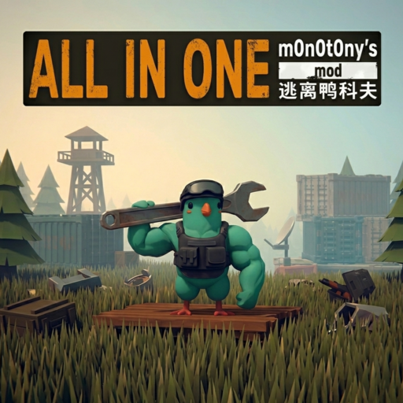

# All In One - m0n0t0ny's Mod

A quality-of-life mod for **Escape from Duckov** with 14 independent features, all toggleable from the **F9** settings panel.

---

## Features

All settings are persisted and configurable from the **F9** panel in-game.

---

### Item sell value on hover

Shows the sell value of an item directly on hover - single unit, full stack, and combined total.

---

### Enemy names above health bar

Displays the enemy's name above their health bar during combat.

---

### Loot container highlight

Gold outline on all lootable containers so you never miss one.

---

### Sleep presets

One-click sleep buttons for common weather conditions: rain, Storm I, Storm II, post-storm, and 4 fully customizable time slots.

---

### Recorded items badge

A ✓ badge on keys and blueprints you have already recorded, so you know at a glance what to keep and what to sell.

---

### Quest favorites

Pin a quest to the top of the list with **N**. The pinned quest is always visible regardless of filters.

---

### Hide controls hint

Hides the native Controls [O] button and its submenu to reduce HUD clutter.

---

### Additional features

| Feature                                                 | Default | Key                         |
| ------------------------------------------------------- | ------- | --------------------------- |
| Modifier+click to transfer items (container ↔ backpack) | ON      | Shift or Alt (configurable) |
| Auto-close container on WASD / Shift / Space / damage   | OFF     | -                           |
| FPS counter (top-right)                                 | OFF     | -                           |
| Skip melee slot on scroll wheel                         | ON      | -                           |
| Auto-unload enemy gun on kill                           | ON      | -                           |
| Kill feed - killer → victim, [HS] on headshots          | ON      | -                           |
| Remember camera view (top-down vs default)              | ON      | -                           |

---

## Installation

### Steam (recommended)

1. Subscribe on the [Steam Workshop page](https://steamcommunity.com/sharedfiles/filedetails/?id=3685814781)
2. Launch the game → **Mods** in the main menu → enable the mod

The mod updates automatically whenever a new version is published.

### Manual

1. Download the latest zip from the [Releases page](https://github.com/m0n0t0ny/All-In-One---m0n0t0ny-s-Mod/releases/latest)
2. Extract the `AllInOneMod_m0n0t0ny` folder into the `Mods` folder of your game installation (create it if it doesn't exist):

   | Platform             | Path                                                                                 |
   | -------------------- | ------------------------------------------------------------------------------------ |
   | Steam (Windows)      | `C:\Program Files (x86)\Steam\steamapps\common\Escape from Duckov\Duckov_Data\Mods\` |
   | Epic Games (Windows) | `C:\Program Files\Epic Games\EscapeFromDuckov\Duckov_Data\Mods\`                     |
   | Steam (Linux)        | `~/.steam/steam/steamapps/common/Escape from Duckov/Duckov_Data/Mods/`               |

3. Launch the game → **Mods** in the main menu → enable the mod

To update manually, replace the `AllInOneMod_m0n0t0ny` folder with the new version.

---

## Building from source

Requirements: .NET SDK, Escape from Duckov installed.

1. Open `duckov_modding/m0n0t0nysMod.sln` in Visual Studio or Rider
2. Set `DuckovPath` in `m0n0t0nysMod.csproj` to your game installation folder
3. Build in Release configuration - the output DLL is in `bin/Release/netstandard2.1/`

---

## Changelog

See [Releases](https://github.com/m0n0t0ny/All-In-One---m0n0t0ny-s-Mod/releases) for the full version history.
