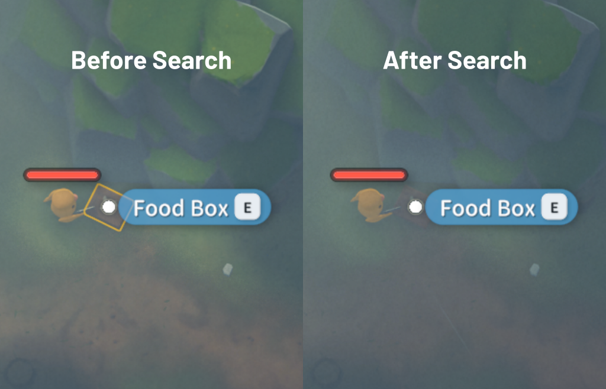

# ALL IN ONE - m0n0t0ny's mod

Mod de qualité de vie tout-en-un pour **Escape from Duckov**. 20 fonctionnalités indépendantes, toutes configurables depuis le menu **Paramètres** natif.

---

## Fonctionnalités

Tous les paramètres sont sauvegardés et configurables depuis l'onglet **ALL IN ONE** dans le menu Paramètres du jeu - accessible depuis le menu principal et le menu pause en jeu.

---

### 🎒 Pillage

#### Afficher la valeur de l'objet au survol
Affiche le prix de vente de n'importe quel objet à tout moment, pas seulement dans les boutiques. Choisissez entre combiné, unitaire, pile ou désactivé.

#### Comptage d'inventaire au survol
Affiche combien d'exemplaires de l'objet survolé vous transportez et combien se trouvent dans votre réserve. Activable depuis les paramètres (ON par défaut).

#### Transfert rapide d'objets
Alt+clic ou Shift+clic pour déplacer instantanément des objets entre un conteneur ouvert et votre sac à dos, et vice versa.

#### Déchargement automatique de l'arme lors d'un kill
Lorsque vous pillez un ennemi tué, son arme est automatiquement déchargée - les munitions vont directement dans la réserve sous forme de pile récupérable, prête à être prise.

#### Badge sur les clés et Blueprints enregistrés
Une coche verte sur les clés et les blueprints déjà enregistrés, pour savoir d'un coup d'œil ce qu'il faut garder et ce qu'il faut vendre.

#### Mise en évidence des conteneurs de butin
Contour coloré sur les conteneurs de butin dans le monde pour ne jamais en rater un. Trois modes : Tous / Seulement les non fouillés / Désactivé. La couleur du bord suit la rareté des objets (blanc pour les conteneurs vides).

#### Affichage de la rareté des objets
Bordure colorée sur les emplacements d'inventaire en fonction de la valeur de vente des objets. Six niveaux du blanc (faible valeur) au rouge (haute valeur). Activable depuis les paramètres.

#### Étiquette de nom d'objet
Les noms des objets dans les emplacements d'inventaire sont centrés et affichés sans étiquette de fond.

---

### ⚔️ Combat

#### Afficher le nom de l'ennemi
Affiche le nom de l'ennemi au-dessus de sa barre de vie.

#### Fil des kills
Affiche les kills dans le coin supérieur droit pendant les raids - tueur, victime et tag [HS] pour les headshots.

#### Marqueurs de carte des boss
Marqueurs en temps réel sur la carte plein écran pour chaque boss, avec code couleur (rouge=vivant, gris=mort). Une superposition avec la liste des boss apparaît lorsque la carte est ouverte. Activable depuis les paramètres (ON par défaut).

#### Afficher les barres de vie cachées des ennemis
Force l'affichage des barres de vie sur les ennemis dont la barre est cachée par défaut (ex. le boss ???). Activable depuis les paramètres (ON par défaut).

#### Ignorer le corps à corps au défilement
La molette de la souris ignore l'emplacement corps à corps lors du changement d'armes. Le corps à corps peut toujours être équipé via V.

---

### 🌙 Survie

#### Préréglages de réveil
Boutons de préréglage de réveil sur l'écran de sommeil : 4 horaires personnalisables, plus pluie, Tempête I, Tempête II et fin de tempête.

#### Fermeture automatique des conteneurs
Ferme automatiquement un conteneur ouvert en appuyant sur WASD, Shift, Espace ou en prenant des dégâts. Chaque déclencheur est activable indépendamment.

---

### 🖥️ HUD

#### Compteur FPS
Affiche les FPS actuels dans le coin supérieur droit (OFF par défaut).

#### Masquer l'indice des contrôles
Masque le bouton natif Contrôles [O] et son sous-menu pour réduire l'encombrement du HUD.

#### Masquer le HUD en ADS
Masque le HUD en maintenant le clic droit pour une expérience de visée plus propre et immersive. Trois modes : Tout masquer / Afficher seulement les munitions / Désactivé. Les barres de vie et le réticule restent toujours visibles.

#### Vue de la caméra
Paramètre à trois modes : Désactivé / Par défaut / Vue du dessus. La vue sélectionnée est appliquée immédiatement et restaurée automatiquement au chargement de la scène.

---

### ⭐ Quêtes

#### Quêtes favorites (touche N)
Appuyez sur N sur une quête sélectionnée pour l'épingler en haut de la liste. Les quêtes épinglées sont toujours visibles quels que soient les filtres.

---

## Installation

### Steam (recommandé)

1. Abonnez-vous sur la [page Steam Workshop](https://steamcommunity.com/sharedfiles/filedetails/?id=3685814781)
2. Lancez le jeu -> **Mods** dans le menu principal -> activez le mod

Le mod se met à jour automatiquement chaque fois qu'une nouvelle version est publiée.

### Manuel

1. Téléchargez le dernier zip depuis la [page Releases](https://github.com/m0n0t0ny/All-In-One---m0n0t0ny-s-Mod/releases/latest)
2. Extrayez le dossier `AllInOneMod_m0n0t0ny` dans le dossier `Mods` de votre installation du jeu (créez-le s'il n'existe pas) :

   | Plateforme           | Chemin                                                                               |
   | -------------------- | ------------------------------------------------------------------------------------ |
   | Steam (Windows)      | `C:\Program Files (x86)\Steam\steamapps\common\Escape from Duckov\Duckov_Data\Mods\` |
   | Epic Games (Windows) | `C:\Program Files\Epic Games\EscapeFromDuckov\Duckov_Data\Mods\`                     |
   | Steam (Linux)        | `~/.steam/steam/steamapps/common/Escape from Duckov/Duckov_Data/Mods/`               |

3. Lancez le jeu -> **Mods** dans le menu principal -> activez le mod

Pour mettre à jour manuellement, remplacez le dossier `AllInOneMod_m0n0t0ny` par la nouvelle version.

---

## Changelog

Consultez les [Releases](https://github.com/m0n0t0ny/All-In-One---m0n0t0ny-s-Mod/releases) pour l'historique complet des versions.
