# ALL IN ONE - m0n0t0ny's mod

[English](README.md) | [Italiano](README_IT.md) | [Français](README_FR.md) | [Deutsch](README_DE.md) | [中文简体](README_ZH_CN.md) | [中文繁體](README_ZH_TW.md) | [日本語](README_JA.md) | [한국어](README_KO.md) | Português | [Русский](README_RU.md) | [Español](README_ES.md)

Mod completo de qualidade de vida para **Escape from Duckov**. 20 funcionalidades independentes, todas configuráveis pelo menu nativo de **Configurações**.

**Conteúdo:** [Funcionalidades](#funcionalidades) · [Saque](#-saque) · [Combate](#-combate) · [Sobrevivência](#-sobrevivência) · [HUD](#-hud) · [Missões](#-missões) · [Desempenho](#desempenho) · [Instalação](#instalação) · [Changelog](#changelog)

---

## Funcionalidades

Todas as configurações são salvas e podem ser ajustadas pela aba **ALL IN ONE** no menu de Configurações do jogo — acessível tanto pelo menu principal quanto pelo menu de pausa no jogo.

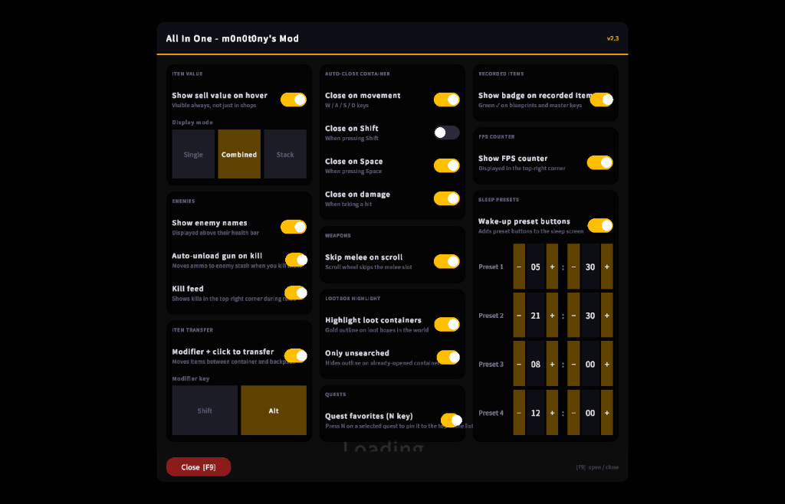

---

### 🎒 Saque

#### Mostrar valor do item ao passar o mouse
Exibe o preço de venda de qualquer item a qualquer momento, não apenas nas lojas. Escolha entre combinado, unitário, pilha ou desativado.

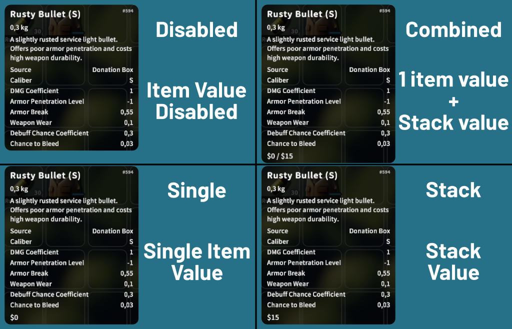

#### Contagem de inventário ao passar o mouse
Mostra quantos do item em foco você está carregando e quantos estão no seu armazém. Ativável nas configurações (ligado por padrão).

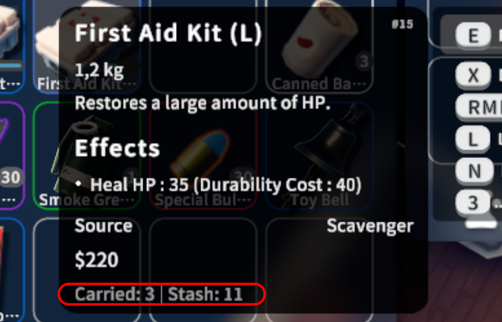

#### Transferência rápida de itens
Alt+clique ou Shift+clique para mover itens instantaneamente entre um contêiner aberto e sua mochila, e vice-versa.

#### Descarregar arma automaticamente ao matar
Ao saquear um inimigo abatido, a arma dele é descarregada automaticamente — a munição vai direto para o armazém como uma pilha coletável, pronta para ser pega.

#### Emblema em chaves e Blueprints registrados
Uma marca de verificação verde em chaves e plantas que você já registrou, para saber de relance o que guardar e o que vender.

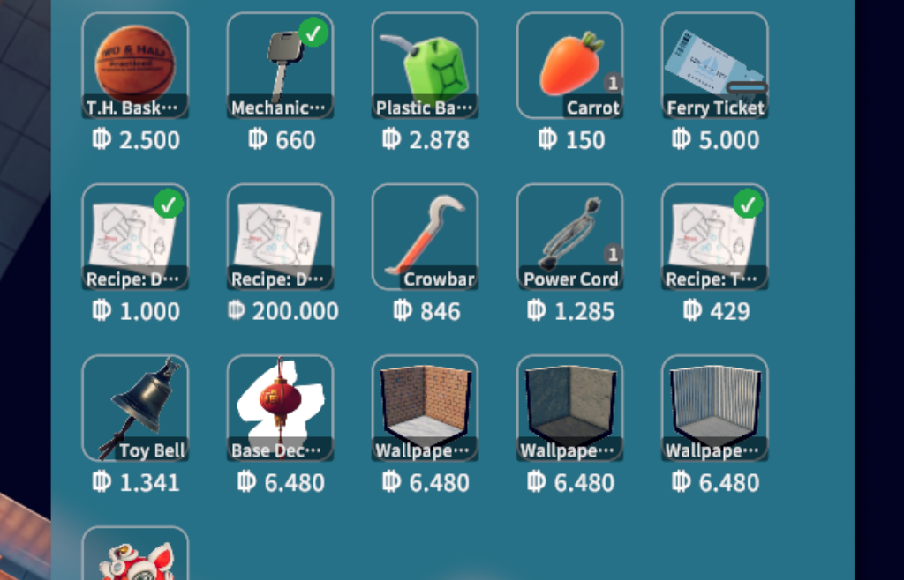

#### Destaque de caixas de saque
Contorno colorido em contêineres de saque no mundo para que você nunca perca nenhum. Três modos: Todos / Apenas não vasculhados / Desativado. A cor da borda segue a raridade do item (branco para contêineres vazios).

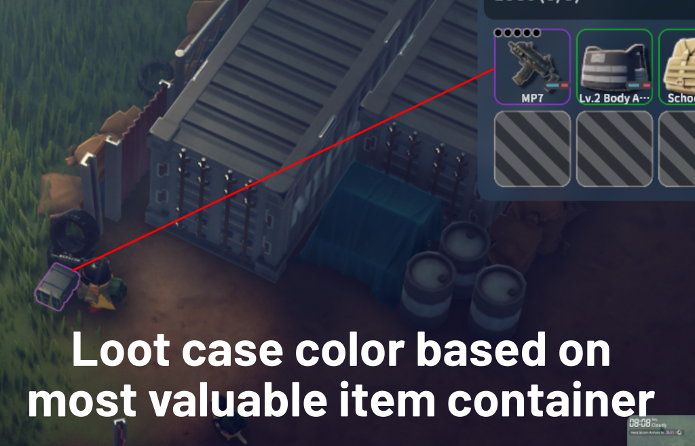

#### Exibição de raridade de itens
Borda colorida nos slots do inventário com base no valor de venda dos itens. Seis níveis do branco (baixo valor) ao vermelho (alto valor). Ativável nas configurações.

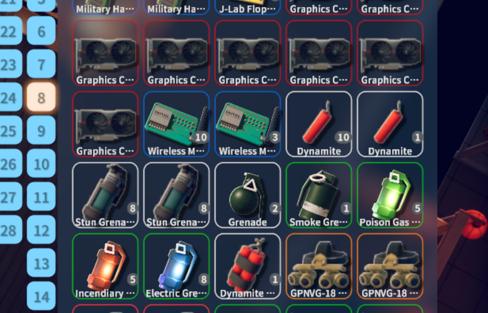

#### Rótulo de nome do item
Os nomes dos itens nos slots do inventário são centralizados e exibidos sem rótulo de fundo.

---

### ⚔️ Combate

#### Mostrar nome do inimigo
Exibe o nome do inimigo acima da barra de vida.

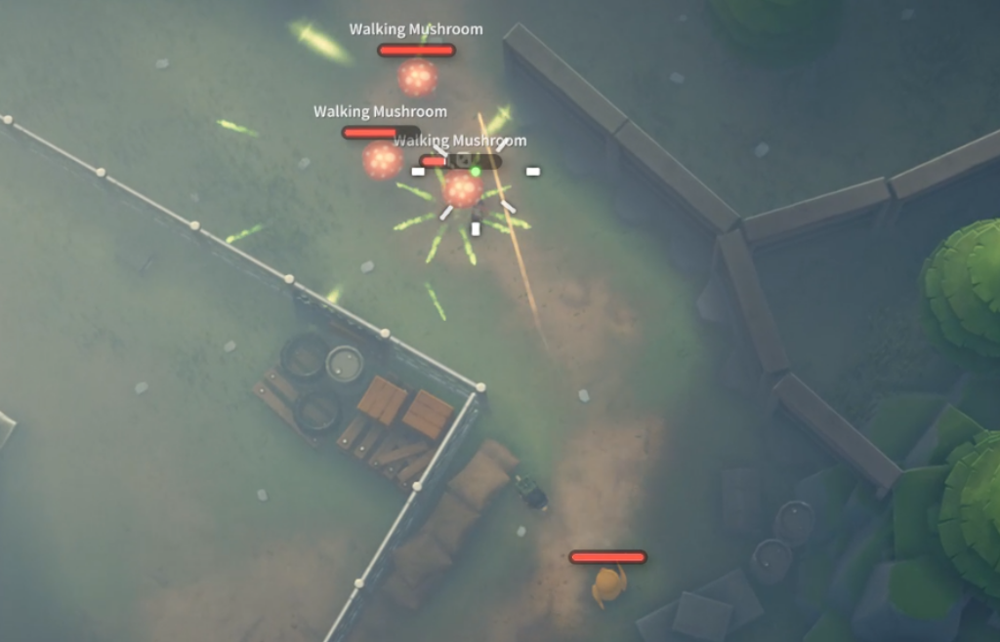

#### Feed de abates
Mostra abates no canto superior direito durante as incursões — matador, vítima e tag [HS] em headshots.

#### Marcadores de chefes no mapa
Marcadores em tempo real no mapa em tela cheia para cada chefe, com código de cores (vermelho=vivo, cinza=morto). Uma sobreposição com a lista de chefes aparece quando o mapa está aberto. Ativável nas configurações (ligado por padrão).

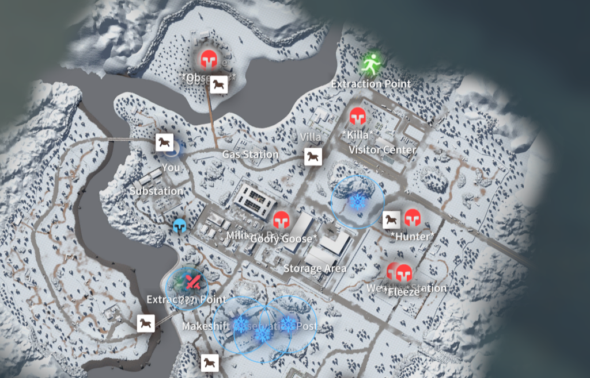

#### Mostrar barras de vida ocultas de inimigos
Força a exibição das barras de vida em inimigos cuja barra está oculta por padrão (ex.: o chefe ???). Ativável nas configurações (ligado por padrão).

#### Pular corpo a corpo ao rolar o scroll
A roda do mouse pula o slot de corpo a corpo ao ciclar pelas armas. O corpo a corpo ainda pode ser equipado via V.

---

### 🌙 Sobrevivência

#### Presets de acordar
Botões de preset de acordar na tela de sono: 4 horários customizáveis, além de chuva, Tempestade I, Tempestade II e fim da tempestade.

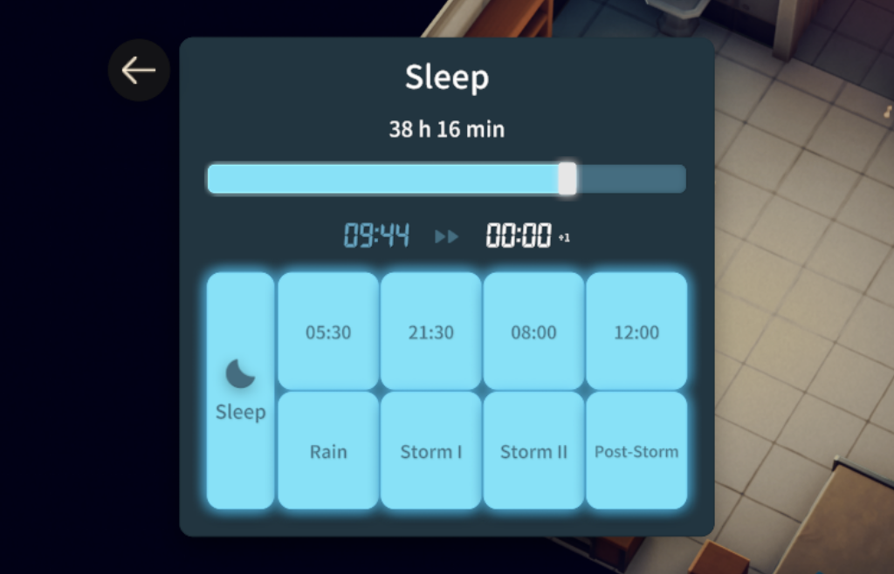

#### Fechar contêiner automaticamente
Fecha automaticamente um contêiner aberto ao pressionar WASD, Shift, Espaço ou ao receber dano. Cada gatilho é ativável independentemente.

---

### 🖥️ HUD

#### Contador de FPS
Exibe o FPS atual no canto superior direito (desligado por padrão).

#### Ocultar dica de controles
Oculta o botão nativo Controles [O] e seu submenu para reduzir a poluição visual do HUD.

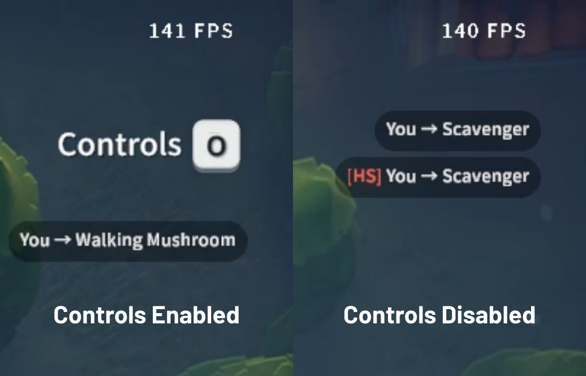

#### Ocultar HUD ao mirar (ADS)
Oculta o HUD enquanto o botão direito do mouse é mantido pressionado para uma experiência de mira mais limpa e imersiva. Três modos: Ocultar tudo / Mostrar apenas munição / Desativado. Barras de vida e mira sempre permanecem visíveis.

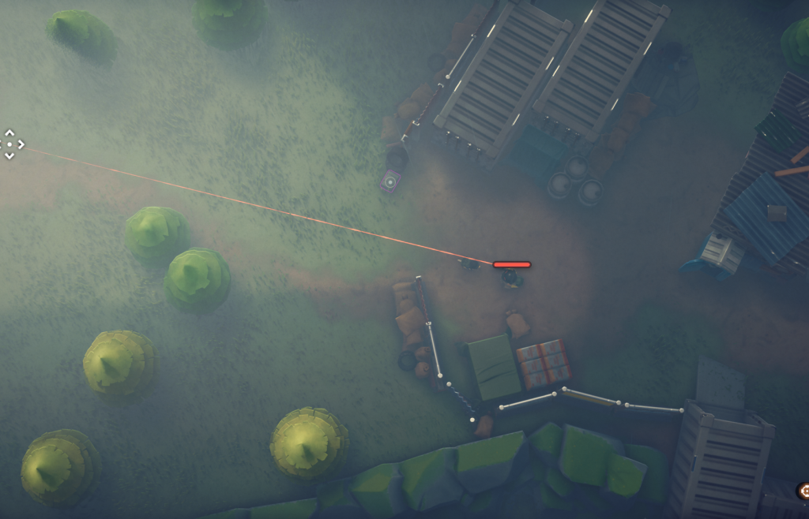

#### Visão da câmera
Configuração de três modos: Desativado / Padrão / Visão de cima. A visão selecionada é aplicada imediatamente e restaurada automaticamente ao carregar a cena.

---

### ⭐ Missões

#### Missões favoritas (tecla N)
Pressione N em uma missão selecionada para fixá-la no topo da lista. Missões fixadas são sempre visíveis independentemente dos filtros.

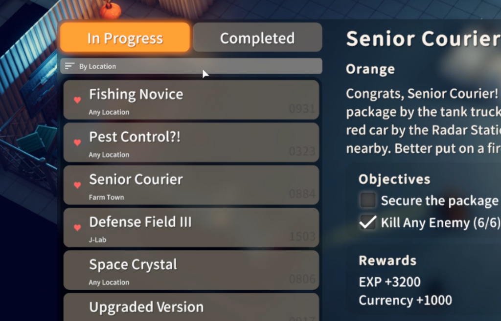

## Desempenho

A maioria dos recursos é orientada por eventos e não tem impacto mensurável no desempenho. Alguns realizam varreduras periódicas da cena que podem causar pequenas travadas em hardware menos potente. Se você experimentar quedas de framerate, tente desativar esses recursos primeiro, em ordem de impacto:

| Recurso | Picos/sessão | Pico médio | Sobrecarga total | % |
|---|---|---|---|---|
| Mostrar barras de vida ocultas de inimigos | 32 | ~24ms | ~768ms | 34% |
| Exibição de raridade de itens | 43 | ~13ms | ~559ms | 25% |
| Destaque de caixas de saque | 32 | ~14ms | ~448ms | 20% |
| Mostrar nome do inimigo | 32 | ~13ms | ~416ms | 18% |
| Marcadores de chefes no mapa | 5 | ~15ms | ~75ms | 3% |

---

## Instalação

### Steam (recomendado)

1. Inscreva-se na [página do Steam Workshop](https://steamcommunity.com/sharedfiles/filedetails/?id=3685814781)
2. Inicie o jogo -> **Mods** no menu principal -> ative o mod

O mod é atualizado automaticamente sempre que uma nova versão é publicada.

### Manual

1. Baixe o zip mais recente na [página de Releases](https://github.com/m0n0t0ny/All-In-One---m0n0t0ny-s-Mod/releases/latest)
2. Extraia a pasta `AllInOneMod_m0n0t0ny` para a pasta `Mods` da instalação do jogo (crie-a se não existir):

   | Plataforma           | Caminho                                                                              |
   | -------------------- | ------------------------------------------------------------------------------------ |
   | Steam (Windows)      | `C:\Program Files (x86)\Steam\steamapps\common\Escape from Duckov\Duckov_Data\Mods\` |
   | Epic Games (Windows) | `C:\Program Files\Epic Games\EscapeFromDuckov\Duckov_Data\Mods\`                     |
   | Steam (Linux)        | `~/.steam/steam/steamapps/common/Escape from Duckov/Duckov_Data/Mods/`               |

3. Inicie o jogo -> **Mods** no menu principal -> ative o mod

Para atualizar manualmente, substitua a pasta `AllInOneMod_m0n0t0ny` pela nova versão.

---

## Changelog

Veja as [Releases](https://github.com/m0n0t0ny/All-In-One---m0n0t0ny-s-Mod/releases) para o histórico completo de versões.
